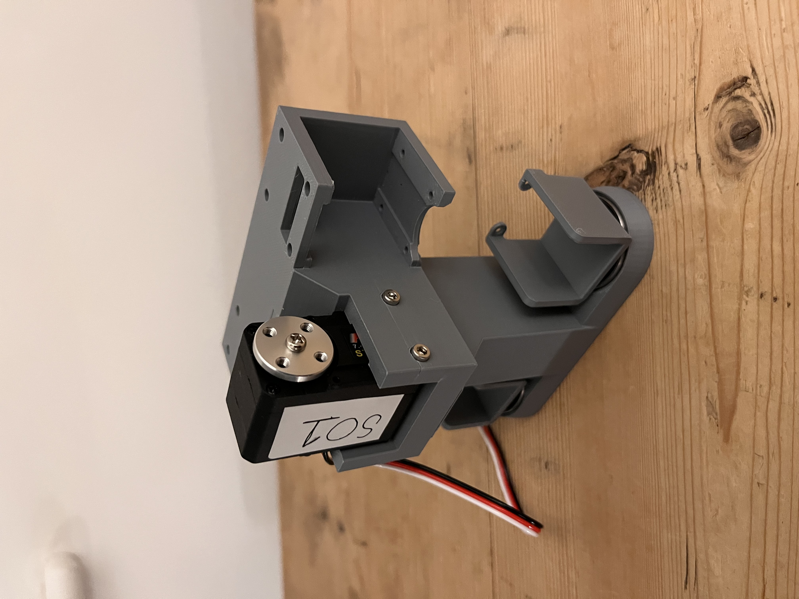
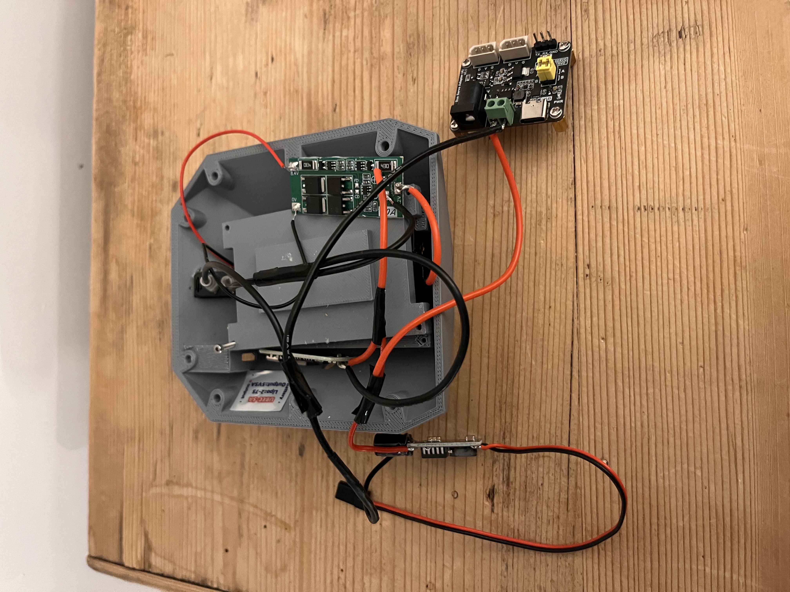

# open-duck-mini-build

Building an open-source humanoid robot while exploring robotics, embedded systems, and AI.

This repository is my build journal for the Open Duck Mini v2: sourcing parts, printing and assembling the robot, documenting calibration, and eventually experimenting with the software stack.

## Build Preview

Early mechanical assembly is now underway. These photos show the first main body and servo-fit progress:





## Attribution

Open Duck Mini is an open-source robotics project by the original project maintainers at [apirrone/Open_Duck_Mini](https://github.com/apirrone/Open_Duck_Mini). This repository is not a fork of the upstream project and does not duplicate the upstream source files. It is a personal build log, workshop notes, shopping tracker, and place for my own modifications or scripts as the build progresses.

Useful upstream links:

- [Open Duck Mini repository](https://github.com/apirrone/Open_Duck_Mini)
- [Open Duck Mini Runtime](https://github.com/apirrone/Open_Duck_Mini_Runtime)
- [Open Duck Mini v2 project listing](https://robotics.growbotics.ai/projects/hardware/open-duck-mini-v2)

## Current Status

Phase 1 workshop setup is complete enough to move forward. The build is now past printing and into fit checks plus hardware sourcing.

Printed so far: all required STL prints and optional TPU foot bottoms are complete. The PLA feet have been dry-fitted, and the TPU foot bottoms are ready for final fit checks.

Hardware sourcing is well underway. The foot micro switches, main STS3215 servos, SG90 servos, BNO055 IMU, Waveshare serial bus servo driver boards, main power switch, battery charger, 18650 cells, 8 x 22 x 7 mm bearings, 5V UBEC, XT30 connectors, DC barrel adapters, red/black wire, Loctite 243, 2S BMS/protection boards, a DC barrel power adapter, a 4K HDMI cable, Raspberry Pi support parts, and a Raspberry Pi Zero 2 W have arrived. A compact replacement 2S battery holder has also arrived, fits the reprinted rear panel, and is now wired into a completed 2S power-pack subassembly. The BMS, rocker switch, USB-C charging board, UBEC, switched 5V output, and raw 7.4V branch have been tested with a multimeter; USB-C charging still needs a controlled test before regular use.

The next milestone is the servo-controller bench setup: splice a switched 7.4V branch from the power-pack output before the UBEC, feed it into the Waveshare controller power input, verify polarity and voltage with a multimeter, then connect one STS3215 servo from a laptop over USB for ID programming.

## Project Progress

Updated: 2026-09-23

Progress is tracked as a practical build estimate rather than an exact percentage. Printing progress is counted from the required printed part quantities in [docs/printing-progress.md](docs/printing-progress.md). The optional TPU foot bottoms are complete as an upgrade to the PLA feet.

```text
Overall build progress   [######----] 58%
Printing progress        [##########] 100%  49 / 49 required printed parts + TPU feet
```

| Area | Progress | Status |
| --- | ---: | --- |
| Workshop setup | 100% | Core tools, soldering setup, fasteners, inserts, wire, and consumables are ready. |
| 3D printing and fit checks | 100% | All required STL prints and optional TPU foot bottoms are complete. PLA feet have been dry-fitted. |
| Hardware sourcing | 80% | STS3215 and SG90 servos, BNO055 IMU, Waveshare serial bus servo driver boards, main power switch, foot switches, cells, charger, bearings, UBEC, BMS boards, connectors, power accessories, GPIO headers, compact battery holder, power-pack wiring, and Raspberry Pi Zero 2 W are received/complete. USB-C charging controlled test and Raspberry Pi runtime setup remain outstanding. |
| Mechanical assembly | 15% | Early servo and main-body assembly is underway; horns/discs are being fitted after electronic centring. |
| Electronics and power | 32% | 2S battery pack, BMS, switch, USB-C charging board, UBEC, switched 5V output, and raw 7.4V branch are wired and tested as a standalone subassembly. The new switched 7.4V branch for the Waveshare servo controller has been spliced and measured at 7.03V; it has not yet powered the controller or a servo. |
| Calibration and first motion | 0% | Not started. |
| Software and runtime experiments | 0% | Not started. |

Current next step: continue the safe one-servo bench-test setup. The switched 7.4V branch for the Waveshare servo controller is now connected after being checked at 7.03V with correct positive/negative polarity. Next, verify voltage at the controller with no servo attached, then use a laptop over USB to detect and program one STS3215 at a time. Do not use the UBEC 5V output for STS3215 servo power.

Progress notes: update this section whenever printing, sourcing, assembly, electronics, calibration, or software progress changes.

## Repository Layout

```text
.
├── README.md
├── bom/
│   └── phase-1.csv
├── cad/
│   └── modified-parts/
├── docs/
│   ├── build-log.md
│   ├── phase-1-workshop.md
│   ├── printing-progress.md
│   └── roadmap.md
├── photos/
│   ├── hardware/
│   ├── phase-1-tools/
│   └── printing/
└── scripts/
```

## Documentation

- [Phase 1 Workshop Setup](docs/phase-1-workshop.md)
- [Printing Progress Tracker](docs/printing-progress.md)
- [Build Log](docs/build-log.md)
- [Roadmap](docs/roadmap.md)
- [Hardware Sourcing Tracker](docs/hardware-sourcing.md)
- [Phase 1 BOM Checklist](bom/phase-1.csv)

## Principles

- Keep attribution clear and link back to the upstream project.
- Document the build process honestly, including mistakes and fixes.
- Avoid copying upstream files unless I am intentionally modifying or extending them.
- Keep purchases phased so the project stays manageable.
- Prefer small, useful commits that show the engineering journey.
